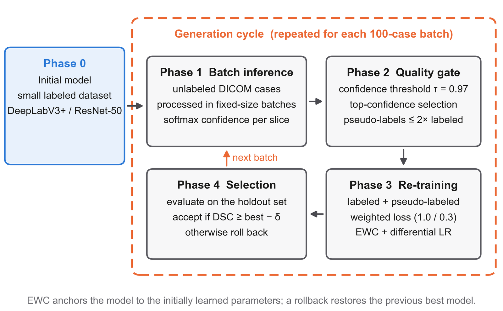
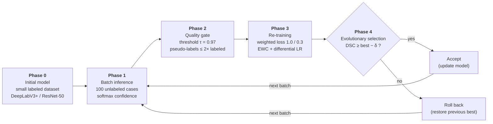

# GT_MRA

Source code for the study

> **Evolutionary Knowledge Update for Intracranial Vessel Segmentation in TOF-MRA:
> Self-Training from Few Labeled Cases**
>
> Hiroyuki Sugimori and Takaaki Yoshimura

A DeepLabV3+ model for intracranial vessel segmentation in Time-of-Flight MR
Angiography is initialised from a small labeled dataset and then evolved on unlabeled
clinical examinations. Confidence-based pseudo-label gating, elastic weight
consolidation (EWC) and an evolutionary rollback rule are combined so that
**performance cannot degrade across updates**.

## Framework



Phase 0 builds the initial model from the labeled dataset; Phases 1–4 are repeated
for each 100-case batch of unlabeled data.



## Method

### Initial model

A combined Dice–cross-entropy loss is used for the supervised stage:

$$\mathcal{L}_{\text{total}} = 0.5\,\mathcal{L}_{\text{CE}} + 0.5\,\mathcal{L}_{\text{Dice}}$$

$$\mathcal{L}_{\text{CE}} = -\frac{1}{N}\sum_{i}\Big[\,g_i \log p_i + (1-g_i)\log(1-p_i)\,\Big]$$

$$\mathcal{L}_{\text{Dice}} = 1 - \frac{2\sum_{i} p_i g_i + \varepsilon}{\sum_{i} p_i + \sum_{i} g_i + \varepsilon}$$

Segmentation quality is reported with the Dice similarity coefficient and the
intersection over union, where $S$ is the prediction and $G$ the ground truth:

$$\mathrm{DSC} = \frac{2\,|S \cap G|}{|S| + |G|}
\qquad
\mathrm{IoU} = \frac{|S \cap G|}{|S \cup G|}$$

### Phase 1 — confidence

A per-slice confidence score is computed from the softmax output over $H \times W$
pixels and $k$ classes:

$$c = \frac{1}{HW}\sum_{h,w}\ \max_{k}\ p_k(h,w)$$

### Phase 2 — quality gate

Slices with $c > \tau$ are kept, capped at a multiple $\rho$ of the labeled set:

$$N_{\text{pseudo}} = \min\big(\rho \cdot N_{L},\ N_{\text{candidates}}\big)$$

### Phase 3 — weighted re-training with EWC

Labeled and pseudo-labeled samples enter the loss with different weights
($w_L = 1.0$, $w_P = 0.3$ in the improved strategy):

$$\mathcal{L}_{\text{weighted}} = \frac{1}{N}\sum_{i} w_i \cdot
\mathcal{L}_{\text{total}}(p_i, y_i)$$

Elastic weight consolidation penalises movement away from the parameters
$\theta^{*}$ learned from labeled data, weighted by the Fisher information $F_i$:

$$\mathcal{L}_{\text{EWC}} = \lambda \sum_{i} F_i\,(\theta_i - \theta_i^{*})^{2}$$

$$F_i = \mathbb{E}_{x \sim D}\left[\left(\frac{\partial \log p(y \mid x, \theta^{*})}
{\partial \theta_i}\right)^{2}\right]$$

### Phase 4 — evolutionary selection

The update is accepted only if it holds performance within a margin $\delta$ on the
holdout set; otherwise the previous best model is restored. This is what makes the
procedure monotonically non-degrading:

$$\text{Action} =
\begin{cases}
\text{Accept}, & \text{if } \mathrm{DSC}_{\text{new}} \ge \mathrm{DSC}_{\text{best}} - \delta\\
\text{Rollback}, & \text{otherwise}
\end{cases}$$

### Strategies compared

| Parameter | Naive | Improved |
|---|---|---|
| Pseudo loss weight $w_P$ | 1.0 | 0.3 |
| Confidence threshold $\tau$ | 0.80 | 0.97 |
| Pseudo-label ratio $\rho$ | ~7.6× | 2.0× |
| LR (backbone / head) | 0.001 / 0.001 | 0.00005 / 0.0005 |
| EWC $\lambda$ | 500 | 1,000 |
| Backbone freeze | no | first 2 epochs |
| Rollback margin $\delta$ | 0.005 | 0.003 |

## Data

**No patient data is included in this repository.** The labeled TOF-MRA cases and
the examinations drawn from the Japan Medical Image Database (J-MID) are covered by
the ethical approval of the participating institution and are not redistributable.
Trained model weights are available on request from the corresponding author.

The scripts expect the following layout relative to the project root:

```
<project root>/
├─ python/                 embedded Python 3.11.9 (not included)
├─ data/mra_seg/
│  ├─ rawJPEG/             input slices, per-case folders
│  ├─ rawPNG/              ground-truth masks, same filenames
│  └─ DICOMdata/           source DICOM (spacing / MIP)
├─ models/
├─ results/
└─ src/                    this repository
```

## Layout

```
src/
├─ paths.py                 all paths in one place, resolved relative to the
│                           project root (nothing is hard-coded)
└─ mra_seg/
   ├─ train_deeplabv3plus_5fold.py      initial model, 5-fold CV
   ├─ train_deeplabv3plus_5fold_v2.py   final version (multi-GPU, Dice-CE)
   ├─ evolutionary_learning.py          naive self-training
   ├─ evolutionary_learning_v2.py       improved: weighted pseudo-label loss,
   │                                    strict confidence gate, ratio cap,
   │                                    differential LR, EWC, rollback
   ├─ viewer_mip.py                     MIP viewer (axial/coronal/sagittal, WW/WL)
   ├─ viewer_overlay.py / _v2.py        overlay comparison viewers
   ├─ plot_evolution.py                 evolution curves
   └─ *.bat                             launchers (call the bundled python)
```

Dataset-specific settings (the case IDs held out for validation, the location of
the unlabeled study store) are empty constants at the top of the scripts; fill
them in for your own data before running.

## Environment

Python 3.11.9 (Windows embeddable). `numpy` is pinned to 1.26.4 because `monai`
requires `numpy<2.0`; `opencv-python-headless` is pinned to 4.10.0.84 for the same
reason. Loosening either breaks the environment.

```
python\python.exe -m pip install -r requirements.txt
python\python.exe src\paths.py          # print resolved paths
```

Training used three NVIDIA RTX PRO 6000 GPUs via `DataParallel`; the scripts detect
the available GPUs rather than assuming a fixed count.

## Citation

Please cite the article once it is published. Details will be added here.

## License

MIT — see [LICENSE](LICENSE).
