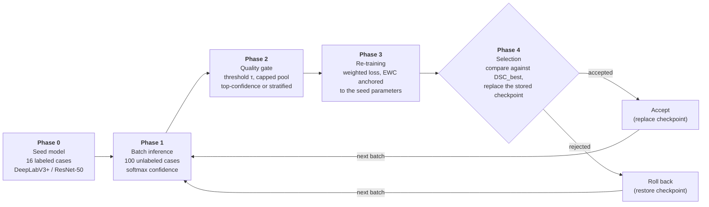

# GT_MRA

Source code for the study

> **Evolutionary Knowledge Update for Intracranial Region Segmentation in TOF-MRA:
> Self-Training from Few Labeled Cases**
>
> Hiroyuki Sugimori and Takaaki Yoshimura
> *Applied Sciences* 2026, 16, 9320 — https://doi.org/10.3390/app16189320

A DeepLabV3+ model for intracranial region segmentation in Time-of-Flight MR
Angiography is initialised from a small labeled dataset and then updated by
self-training on unlabeled clinical examinations, with confidence-gated
pseudo-labels, elastic weight consolidation (EWC), and a rollback rule. The study
runs this framework in six configurations (eight runs over two seeds) and reports
what it does — in particular, that the selection rule compares candidates against
the **recorded best score** while acceptance replaces the **stored checkpoint**:
with a tolerance δ > 0 under replace-on-acceptance these two separate, and the
deployed model can degrade while the recorded best never moves. With δ = 0 and
replacement only on strict improvement, the record tracks the deployed model by
construction.

## Framework


*Figure 1 of the article (CC BY 4.0).*

Phase 0 builds the seed model from the 16 training cases of one cross-validation
fold; the fold's remaining four cases form the holdout used in Phase 4 and
nowhere else. Phases 1–4 are repeated for each 100-case batch of unlabeled data.



## Method

### Seed model

A combined Dice–cross-entropy loss is used for the supervised stage:

$$\mathcal{L}_{\text{total}} = 0.5\,\mathcal{L}_{\text{CE}} + 0.5\,\mathcal{L}_{\text{Dice}}$$

Segmentation quality is reported with the Dice similarity coefficient (DSC) and
the intersection over union (IoU), where $S$ is the prediction and $G$ the
ground truth:

$$\mathrm{DSC} = \frac{2\,|S \cap G|}{|S| + |G|}
\qquad
\mathrm{IoU} = \frac{|S \cap G|}{|S \cup G|}$$

### Phase 1 — confidence

A per-slice confidence score is computed from the softmax output over $H \times W$
pixels and $k$ classes:

$$c = \frac{1}{HW}\sum_{h,w}\ \max_{k}\ p_k(h,w)$$

This score is confounded by anatomy: it correlates negatively with the predicted
foreground fraction, and on labeled slices it tended to rank less accurate
model-generated labels higher (Section 3.4 of the paper;
`diagnose_confidence.py`, `conf_vs_accuracy.py`).

### Phase 2 — quality gate

Slices with $c > \tau$ are kept, capped at
$N_{\text{pseudo}} = \min(\rho \cdot N_{L},\ N_{\text{candidates}})$ or at a
fixed count. The pool is cumulative across generations and truncated to the cap
by confidence. Two selection rules are used: **top-conf** keeps the
highest-confidence slices directly; **stratified** divides the predicted
foreground fraction into ten equal-width strata (width 0.06; slices at or above
0.60 join the top stratum), gives each stratum an equal quota of
$N_{\text{pseudo}}/10$ filled by the highest-confidence slices within the
stratum, and does not reallocate shortfalls.

### Phase 3 — weighted re-training with EWC

Labeled and pseudo-labeled samples enter the loss with weights $w_L = 1.0$ and
$w_P$. EWC penalises movement away from the seed parameters $\theta^{*}$,
weighted by the Fisher information $F_i$ (estimated once from the seed and held
fixed, so the anchor never moves):

$$\mathcal{L}_{\text{EWC}} = \lambda \sum_{i} F_i\,(\theta_i - \theta_i^{*})^{2}$$

### Phase 4 — selection rule and checkpoint policy

A candidate is accepted when its holdout score lies within a tolerance δ of the
best score recorded over all previous generations:

$$\text{Action} =
\begin{cases}
\text{Accept}, & \text{if } \mathrm{DSC}_{\text{cand}} \ge \mathrm{DSC}_{\text{best}} - \delta\\
\text{Rollback}, & \text{otherwise}
\end{cases}$$

Two quantities are involved and they are not the same: $\mathrm{DSC}_{\text{best}}$
is a record, updated only when a candidate exceeds it; the stored checkpoint is
what would be deployed. With δ = 0 and replacement only on strict improvement
the two move together. With δ > 0 under replace-on-acceptance they separate: in
the paper's Naive runs the deployed model fell by 0.0046 and 0.0033 while the
recorded best never moved. The paper therefore recommends δ = 0 as the default,
and — where a tolerance is genuinely needed — retaining the best-scoring rather
than the most recently accepted checkpoint, and monitoring the retained
checkpoint's measured score, never the record.

### Configurations (Table 1 of the paper)

| Configuration | Seeds | δ | Checkpoint rule | Selection | Pool | EWC λ | $w_P$ | τ | Epochs |
|---|---|---|---|---|---|---|---|---|---|
| Naive | fold 1, 2 | 0.005 | DSC ≥ best − δ | top-conf | 20,000 | 500 | 1.0 | 0.80 | 5 |
| Strict-topconf | fold 1, 2 | 0 | DSC > best | top-conf | 2× labeled | 1,000 | 0.3 | 0.97 | 7 |
| Strict-stratified | fold 1 | 0 | DSC > best | stratified | 2× labeled | 1,000 | 0.3 | 0.97 | 7 |
| Strict-large-pool | fold 1 | 0 | DSC > best | top-conf | 20,000 | 1,000 | 0.3 | 0.97 | 7 |
| Strict-weak-EWC | fold 1 | 0 | DSC > best | top-conf | 2× labeled | 100 | 0.3 | 0.97 | 7 |
| Strict-combined | fold 1 | 0 | DSC > best | stratified | 20,000 | 100 | 0.3 | 0.97 | 7 |

Naive differs from the δ = 0 family in its re-training settings as well as in
its rule; the comparison isolates no single factor (Section 2.6 of the paper).

## Reproducing the study

```
python\python.exe src\paths.py                                # check resolved paths
python\python.exe src\mra_seg\train_deeplabv3plus_5fold.py    # seeds, 5-fold CV
python\python.exe src\mra_seg\evolutionary_learning.py <configuration> [fold]
python\python.exe src\mra_seg\eval_retained_models.py <fold>  # Tables 3-4
python\python.exe src\mra_seg\eval_dsc_aggregation.py         # Tables 2, 5
python\python.exe src\mra_seg\eval_mip_contamination.py <fold> <configuration>
python\python.exe src\mra_seg\mip_percase_stats.py <fold> <configuration>   # Table 6 context
python\python.exe src\mra_seg\diagnose_confidence.py [fold]   # Figure 4
python\python.exe src\mra_seg\conf_vs_accuracy.py [fold]      # Section 3.4
```

## Data

**No patient data is included in this repository.** The labeled TOF-MRA cases and
the examinations drawn from the Japan Medical Image Database (J-MID) are covered by
the ethical approval of the participating institution and are not redistributable.
Trained model weights are available on request from the corresponding author.

The scripts expect the following layout relative to the project root:

```
<project root>/
├─ python/                 embedded Python 3.11.9 (not included)
├─ data/mra_seg/
│  ├─ rawJPEG/             input slices, per-case folders
│  ├─ rawPNG/              ground-truth masks, same filenames
│  └─ DICOMdata/           source DICOM (spacing / MIP)
├─ data/mra_studies/       unlabeled DICOM studies (not included)
├─ models/
├─ results/
└─ src/                    this repository
```

## Layout

```
src/
├─ paths.py                 all paths in one place, resolved relative to the
│                           project root (nothing is hard-coded)
└─ mra_seg/
   ├─ train_deeplabv3plus_5fold.py   seed models (SGD, poly decay, 132 epochs)
   ├─ evolutionary_learning.py       the framework: six configurations
   ├─ eval_retained_models.py        fp32 re-measurement of every checkpoint
   ├─ eval_dsc_aggregation.py        slice mean / case mean / global DSC
   ├─ eval_mip_contamination.py      task-relevant MIP measure
   ├─ mip_percase_stats.py           case-to-case variability of the MIP deltas
   ├─ diagnose_confidence.py         what the confidence score ranks
   ├─ conf_vs_accuracy.py            confidence vs. per-slice label accuracy
   ├─ viewer_mip.py                  MIP viewer (axial/coronal/sagittal, WW/WL)
   ├─ viewer_overlay.py              overlay comparison viewer
   └─ *.bat                          launchers (call the bundled python)
```

The five-fold split is derived from `KFold(n_splits=5, shuffle=True,
random_state=42)` over the sorted case IDs, so every script reproduces the same
train/holdout partition without hard-coded case lists.

## Environment

Python 3.11.9 (Windows embeddable). `numpy` is pinned to 1.26.4 because `monai`
requires `numpy<2.0`; `opencv-python-headless` is pinned to 4.10.0.84 for the same
reason. Loosening either breaks the environment.

```
python\python.exe -m pip install -r requirements.txt
python\python.exe src\paths.py          # print resolved paths
```

The runs in the paper used one NVIDIA GPU per configuration (bf16 autocast,
channels_last); the scripts detect the available GPUs rather than assuming a
fixed count.

## Citation

```bibtex
@article{Sugimori2026GTMRA,
  author  = {Sugimori, Hiroyuki and Yoshimura, Takaaki},
  title   = {Evolutionary Knowledge Update for Intracranial Region Segmentation
             in TOF-MRA: Self-Training from Few Labeled Cases},
  journal = {Applied Sciences},
  year    = {2026},
  volume  = {16},
  number  = {18},
  pages   = {9320},
  doi     = {10.3390/app16189320}
}
```

## License

MIT — see [LICENSE](LICENSE).
